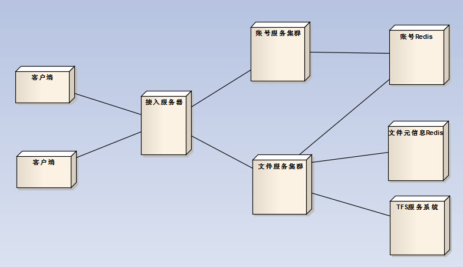

#####云盘服务系统
    存储文件，图片的服务系统

部署图: 

部署环境： 
* 只支持Linux系统

网络框架： 
* 使用的tbsdk（tbnet，tbsys）
* tbsdk是一个Linux下的C++服务端开发框架，结构简单清晰，高性能
* [tbsdk源码地址](http://code.taobao.org/p/tb-common-utils/src/trunk/tbnet/)
* [tbsdk框架解析](http://blog.chinaunix.net/uid-20196318-id-3142050.html)

数据库：
* redis

文件系统：
* 淘宝TFS文件系统
* [淘宝TFS首页](http://tfs.taobao.org/)

#####源码结构
lljz_disk_2 
----src 
--------access_server   （接入服务器） 
--------account_server  （账号服务器） 
--------file_server     （文件服务器）  
--------client          （C++版测试客户端，可以进行压力测试，只能在linux下使用）  
--------py_client       （python版客户端，用于功能测试，网络使用boost-python和tbsdk做的扩展，只能在linux下使用） 
--------packets         （公共请求、应道类型定义） 
--------public          （公共类型定义） 
--------public_handler  （公共消息处理） 
--------redis           （基于hiredis，封装业务使用的redis命令） 

#####缺点
* 大文件分片存储，对于大文件不利于分析

#####TODO_LIST
    1.安全认证
    2.对文件取指纹，增加引用计数
    3.Windows版测试客户端
    4.文件元信息按照hash类型存储在redis，数据结构分散，需要进一步设计
    5.Makfile自动依赖，目前逐个文件编写

